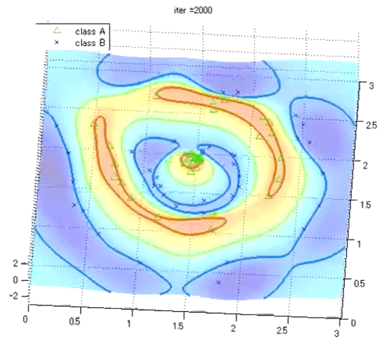
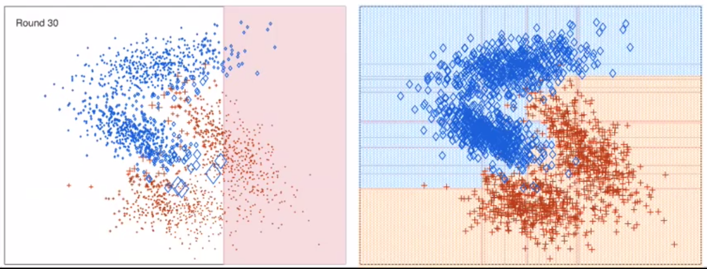
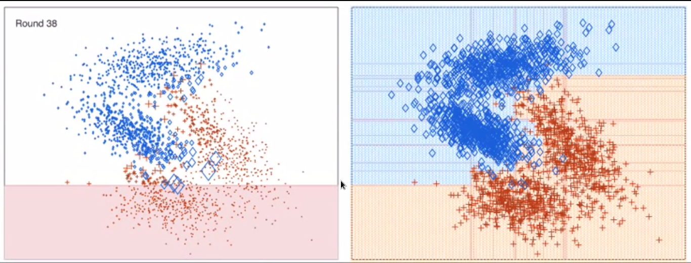

```{r setup, include=FALSE}
knitr::opts_chunk$set(echo = TRUE)
```

# Introducción

La base de datos que hemos cogido es _Breast Cancer Wisconsin (Diagnostic)_. Se trata de una base de datos con 569 ejemplos y con 30 características más la clase. Se trata de un problema de clasificación binaria donde las clases son _Malignant_ y _Benign_. Las 30 características son de 3 imágenes de 3 células distintas en las cuales se han medido 10 características para cada imagen.

# Preparación de los datos

En cuanto a la preparación de los datos hemos quitado la primera columna ya que es un mero identificador de cada ejemplo y hemos cambiado la clase a valores numéricos, para que luego se pueda hacer una predicción sobre la misma.

```{r Preparacion}
set.seed(3)
suppressWarnings(suppressMessages(library("caret"))) # preProcess
suppressWarnings(suppressMessages(library("ROCR"))) # prediction
suppressWarnings(suppressMessages(library("pracma"))) # trapz

wdbc = read.csv("./Datos/wdbc.data", header = F, sep = ",", stringsAsFactors=FALSE)
# Eliminamos el identificador
wdbc = wdbc[, -1]
# Cambiamos el nombre de las columnas (por comodidad)
names(wdbc) = c("clase", 1:(dim(wdbc)[2]-1))
# Cambiamos la clase, Maligno por 1 y benigno por 0
clase = mapply(function(x) ifelse(x=="M", 1, 0), wdbc[,1], USE.NAMES = F)
wdbc = cbind(clase, wdbc[,-1])

# Comprobamos si hay valores NA
apply(wdbc, 2, function(x) sum(is.na(x)))
```

Como hemos visto, no hay ningún atributo perdido (NA) en nuestra base de datos, por lo que no debemos realizar ningún tratamiento especial de los mismos. Ahora vamos a realizar las distintas particiones. Para ello, vamos a crear cinco conjuntos con el 20% de datos cada uno de ellos y vamos a aplicar la técnica _k-fold_ con k = 5.

```{r}
reducir = function(lista, size, indice){
  if(length(unlist(lista)) > size){
    aux = unlist(lista, use.names = F)
    guardar = aux[length(aux)]
    aux = aux[-length(aux)]
    list(aux, guardar, indice)
  }
}

sobrantes = function(lista, size){
  sobrantes = c()
  for(i in 1:5){
    resultado = reducir(lista[i], size, i)
    if(!is.null(resultado)){
      lista[[resultado[[3]]]] = resultado[[1]]
      sobrantes = c(sobrantes, resultado[[2]])
    }
  }
  list(lista, sobrantes)
}

# Creamos los conjuntos de datos de manera balanceada
# y haciendo k-fold con k = 5 (80% train y 20% test)
pos = sample(which(wdbc[,1] == 1))
neg = sample(which(wdbc[,1] == 0))

# Separamos las tiquetas positivas y negativas
# para tener unos conjuntos balanceados
particiones_pos = split(pos, cut(seq_along(pos), 5, labels = F))
particiones_neg = split(neg, cut(seq_along(neg), 5, labels = F))
#Cogemos los datos de los indices según las particiones de los indices
wdbc.pos <- lapply(particiones_pos, function(part) wdbc[part,])
wdbc.neg <- lapply(particiones_neg, function(part) wdbc[part,])

#Debemos comprobar que sean todos del mismo tamaño, así que cogemos el mínimo
pos.size = min(unlist(lapply(particiones_pos, length)))
neg.size = min(unlist(lapply(particiones_neg, length)))

# Guardamos las asignaciones sobrantes
resultado = sobrantes(particiones_pos, pos.size)
particiones_pos = resultado[[1]]
pos.extras = as.vector(resultado[[2]])
resultado = sobrantes(particiones_neg, neg.size)
particiones_neg = resultado[[1]]
neg.extras = as.vector(resultado[[2]])
extras = c(pos.extras, neg.extras)

#Cogemos los datos de los indices según las particiones de los indices
wdbc.pos <- lapply(particiones_pos, function(part) wdbc[part,])
wdbc.neg <- lapply(particiones_neg, function(part) wdbc[part,])

#Generamos los cinco conjuntos
conjunto_1 = rbind(wdbc.pos[[1]], wdbc.neg[[1]])
conjunto_2 = rbind(wdbc.pos[[2]], wdbc.neg[[2]])
conjunto_3 = rbind(wdbc.pos[[3]], wdbc.neg[[3]])
conjunto_4 = rbind(wdbc.pos[[4]], wdbc.neg[[4]])
conjunto_5 = rbind(wdbc.pos[[5]], wdbc.neg[[5]])

#Añadimos lo que ha sobrado
l = list(conjunto_1, conjunto_2, conjunto_3, conjunto_4, conjunto_5)
for(i in 1:length(extras)){
  l[[i]] = rbind(l[[i]], wdbc[extras[i],])
}

# Ya tenemos los conjuntos creados (cada uno tiene el 20% de los datos)
conjunto_1 = l[[1]]
conjunto_2 = l[[2]]
conjunto_3 = l[[3]]
conjunto_4 = l[[4]]
conjunto_5 = l[[5]]

#Repartimos los conjuntos
test_1 = conjunto_1
train_1 = rbind(conjunto_2, conjunto_3, conjunto_4, conjunto_5)
test_2 = conjunto_2
train_2 = rbind(conjunto_1, conjunto_3, conjunto_4, conjunto_5)
test_3 = conjunto_3
train_3 = rbind(conjunto_1, conjunto_2, conjunto_4, conjunto_5)
test_4 = conjunto_4
train_4 = rbind(conjunto_1, conjunto_2, conjunto_3, conjunto_5)
test_5 = conjunto_5
train_5 = rbind(conjunto_1, conjunto_2, conjunto_3, conjunto_4)
```

# Explicación del procedimiento

Para obtener unos resultados más fiables hemos usado la técnica de validación cruzada con _k-fold_, en la cual vamos a hacer 5 repeticiones del procedimiento explicado a continuación. El procedimiento seguido para cada modelo es el mismo:

1. Cogemos como test el 20% de los datos (correspondiente a la partición i-ésima donde i representa la iteración) y como train el 80% restante de los datos.

2. A continuación los preprocesarmos. Para ello usamos la función _preProcess_. El preprocesamiento que hacemos es un centrado y un escalado, ya que los datos no dependen de máximos, ni de mínimos, ni dependen de la varianza de los mismos. Este preprocesamiento se hace sobre el conjunto de train y el resultado obtenido se aplica al conjunto de test. Esto se hace para que las modificaciones que se hacen en el train no se vean influidas por el conjunto de test. 

3. Una vez tenemos los datos preprocesados ajustamos el modelo correspondiente. Los modelos reciben como argumento una fórmula que describe el modelo que se va a ajustar. Todos nuestros modelos van a tener la siguiente fórmula: _clase ~ resto de características_. Esto quiere decir que nuestro modelo va a predecir la clase en función del resto de características de nuestro conjunto de datos.

4. Con el modelo ajustado, predecimos las clases del conjunto de test.

5. Con las clases predecidas y con las clases reales de los ejemplos de test calculamos la curva ROC y la pintamos. También calculamos el área debajo de la curva ROC y la guardamos. La curva ROC representa el ratio entre verdaderos positivos frente al ratio de falsos positivos según el umbral de discriminación, valor a partir del cual decidimos que un caso es positivo. Nosotros vamos a usar la curva ROC para calcular el area bajo la misma. A mayor área, mejor es el modelo.

Una vez hemos acabado el proceso de validación cruzada, nuestro resultado es la media de las areas obtenidas.

# Modelo lineal: Regresión Lineal

Para el modelo líneal vamos a usar Regresión Lineal y Regresión Logística para compararlas. Ahora vamos a usar Regresión Lineal y posteriormente Logística. Vamos a usar la función _glm_, esta función recibe como argumentos el conjunto de datos, _train_ en nuestro caso, y la fórmula que describe el modelo que se va a ajustar.

```{r MLRLineal}
RegresionLineal = function(plot = F) {
  set.seed(3)
  par(mfrow=c(2,3))
  areas = NULL

  for(i in 1:5){
    # Preprocesamos los datos
    train = eval(as.name(paste0("train_", i)))
    test = eval(as.name(paste0("test_", i)))
    clase = train[,1]
    train = train[,-1]
    # No hacemos YeoJohnson porque da un warning por problemas de convergencia
    # "Convergence failure: return code = 52"
    obj = preProcess(train, method = c("center", "scale", "pca"), thresh=0.95)
    train = predict(obj, train)
    train = as.data.frame(cbind(clase, train))
    clase = test[,1]
    test = test[,-1]
    test = predict(obj, test)
    test = as.data.frame(cbind(clase, test))
    
    # Estimamos el modelo
    rlModel = glm(train$clase ~ ., data = train)
    
    # Obtenemos la curca ROC
    predict = predict(rlModel, as.data.frame(test[,-1]), type="response")
    prediction = prediction(predict, test$clase)
    rend = performance(prediction,"tpr","fpr")
    # Y el area debajo de la curva ROC
    area = trapz(unlist(rend@x.values), unlist(rend@y.values))
    # Guardamos el area
    areas[i] = area
    
    if(plot == T){
      plot(rend, col = i, main = "R. Lineal.") 
    }
  }
  areas
}

areaRLineal = RegresionLineal(plot = T)
cat("Area media bajo la curva ROC para un modelo lineal (regresión lineal):", 
    mean(areaRLineal), "\n")
```

# Modelo lineal: Regresión Logística

Ahora vamos a usar Regresión Logística. Esta función recibe como argumentos el conjunto de datos, _train_ en nuestro caso, la fórmula que describe el modelo que se va a ajustar y debemos indicarle en el argumento _family_ que use como familia de funciones _binomial(logit)_, lo cual nos permite hacer regresión logística.

```{r MLRLogistica}
RegresionLogistica = function(plot = F) {
  set.seed(3)
  par(mfrow=c(2,3))
  areas = NULL

  for(i in 1:5){
    # Preprocesamos los datos
    train = eval(as.name(paste0("train_", i)))
    test = eval(as.name(paste0("test_", i)))
    clase = train[,1]
    train = train[,-1]
    # No hacemos YeoJohnson porque da un warning por problemas de convergencia
    # "Convergence failure: return code = 52"
    obj = preProcess(train, method = c("center", "scale", "pca"), thresh=0.95)
    train = predict(obj, train)
    train = as.data.frame(cbind(clase, train))
    clase = test[,1]
    test = test[,-1]
    test = predict(obj, test)
    test = as.data.frame(cbind(clase, test))
    
    # Estimamos el modelo
    rlModel = glm(train$clase ~ ., data = train, family = binomial(logit))
    
    # Obtenemos la curca ROC
    predict = predict(rlModel, as.data.frame(test[,-1]), type="response")
    prediction = prediction(predict, test$clase)
    rend = performance(prediction,"tpr","fpr")
    # Y el area debajo de la curva ROC
    area = trapz(unlist(rend@x.values), unlist(rend@y.values))
    
    # Guardamos el area
    areas[i] = area
    
    if(plot == T){
      plot(rend, col = i, main = "R. Logística.")
    }
  }
  areas
}

areaRlogistica = RegresionLogistica(plot = T)
cat("\nArea media bajo la curva ROC para un modelo lineal (regresión logística):", 
    mean(areaRlogistica), "\n")
```

Como podemos ver, obtenemos muy buenos resultados usando modelos lineales. De hecho, al usar regresión logística obtenemos un warning que nos indica que han ocurrido probabilidades 0 ó 1. Esto quiere decir que un modelo líneal es bastante potente como para poder obtener unos buenos resultados. Esto nos lleva a pensar que los datos son linealmente separables. Hemos hecho regresión lineal y regresión logística por comparar ambos modelos, aunque por la teoría sabemos que la regresión logística obtiene unos mejores resultados en problemas de clasificación binaria, ya que da una probabilidad de que una muestra pertenezca a una clase en vez de dar la clase directamente como sucede en regresión líneal.

# Red Neuronal

Para redes neuronales vamos a usar la función _neuralnet_. Esta función recibe como argumentos la fórmula del modelo que queremos ajustar, el conjunto de datos para aprender el modelo, un tercer argumento denominado _hidden_ y un cuarto _linear.output_. El argumento _hidden_ es un vector donde el tamaño del mismo indica el número de capas ocultas y el valor del indice i indica el número de unidades ocultas de la capa i. Por ejemplo, si el vector que le pasamos es (1, 2, 10) tendríamos una red neuronal con 3 capas ocultas donde la primera tiene 1 unidad, la segunda tiene 2 y la tercera tiene 10. El argumento _linear.output_ está puesto a false para active la función de activación de las neuronas e indique que estamos ante una tarea de clasificación y no de regresión. Como aclaración, la función _neuralnet_ no permite que introduzcamos la fórmula con la sintáxis tradicional. Por ello está la sentencia _f = as.formulas(paste(...))_ que permite crear de manera automática la fórmula que requiere nuestro modelo. La fórmulas que se crea es de la forma _clase ~ caracteristica 1 + ... + caracteristica n_ para cada característica del conjunto de datos que sea distinta _clase_.

```{r RN}
RedNeuronal = function(capas_ocultas = c(1), plot = F) {
  set.seed(3)
  par(mfrow=c(2,3))
  suppressWarnings(suppressMessages(library("neuralnet")))
  areas = NULL

  for(i in 1:5){
    # Preprocesamos los datos
    train = eval(as.name(paste0("train_", i)))
    test = eval(as.name(paste0("test_", i)))
    clase = train[,1]
    train = train[,-1]
    # No hacemos YeoJohnson porque da un warning por problemas de convergencia
    # "Convergence failure: return code = 52"
    obj = preProcess(train, method = c("center", "scale", "pca"), thresh=0.95)
    train = predict(obj, train)
    train = as.data.frame(cbind(clase, train))
    clase = test[,1]
    test = test[,-1]
    test = predict(obj, test)
    test = as.data.frame(cbind(clase, test))
    
    # Usamos una fórmula hecha a mano ya que la función neuralnet no admite
    # la sintaxis usada hasta ahora (y ~ x)
    f = as.formula(paste("clase ~", paste(names(train)[!names(train) %in% "clase"], 
                                          collapse = " + ")))
    
    # Estimamos el modelo
    # El argumento linear.output = F indica que queremos que se use la 
    # función de activación y que no queremos hacer regresión sino clasificación.
    nnModel = neuralnet(f, data=train, hidden=capas_ocultas, linear.output=F)
    
    # Obtenemos la curca ROC
    predict = compute(nnModel, test[,-1])
    # La función prediction está en ROCR y en neuralnet
    # así que da error tener los dos paquetes cargados a
    # la vez, así que tenemos que desactivar los dos y cargar
    # ROCR de nuevo
    detach("package:neuralnet", unload=TRUE)
    
    suppressWarnings(suppressMessages(library("ROCR")))
    prediction = prediction(predict$net.result, test$clase)
    rend = performance(prediction,"tpr","fpr")
    detach("package:ROCR", unload=TRUE)
    suppressWarnings(suppressMessages(library("neuralnet")))
    
    # Y el area debajo de la curva ROC
    area = trapz(unlist(rend@x.values), unlist(rend@y.values))
    # Guardamos el area
    areas[i] = area
    
    if(plot == T){
      plot(unlist(rend@x.values), unlist(rend@y.values), type = "l", 
           xlab = "False positive rate", ylab = "True positive rate", col = i, 
           main = paste("Capas:", paste(capas_ocultas, collapse = ",")))
    }
  }
  
  areas
}

area_1_1 = RedNeuronal(capas_ocultas = c(1), plot = T)
area_2_1 = RedNeuronal(capas_ocultas = c(1, 1), plot = T)
area_3_1 = RedNeuronal(capas_ocultas = c(1, 1, 1), plot = T)
area_1_10 = RedNeuronal(capas_ocultas = c(10), plot = T)
area_2_10 = RedNeuronal(capas_ocultas = c(10, 10), plot = T)
area_3_10 = RedNeuronal(capas_ocultas = c(10, 10, 10), plot = T)
area_1_25 = RedNeuronal(capas_ocultas = c(25), plot = T)
area_2_25 = RedNeuronal(capas_ocultas = c(25, 25), plot = T)
area_3_25 = RedNeuronal(capas_ocultas = c(25, 25, 25), plot = T)
area_1_50 = RedNeuronal(capas_ocultas = c(50), plot = T)
area_2_50 = RedNeuronal(capas_ocultas = c(50, 50), plot = T)
area_3_50 = RedNeuronal(capas_ocultas = c(50, 50, 50), plot = T)

area_3_1_5_10 = RedNeuronal(capas_ocultas = c(1, 5, 10), plot = T)
area_3_5_10_25 = RedNeuronal(capas_ocultas = c(5, 10, 25), plot = T)
area_3_10_25_50 = RedNeuronal(capas_ocultas = c(10, 25, 50), plot = T)

detach("package:neuralnet", unload=TRUE)
suppressWarnings(suppressMessages(library("ROCR")))
```

Hemos visto que se puede inicializar el vector de pesos y que en las transparencias de teoría se nos indica como hacerlo. Lo hemos probado, generando un valor de la distribución gausiana para cada característica. En nuestro caso, tras aplicar PCA a nuestros datos nos quedamos con 10 características más la clase, así que hemos generado 11 valores. Al pasarle este vector a la función _neuralnet_ en el argumento _startweights_ salta un warning indicando que faltan pesos y que se generaran aleatoriamente. Tras usar la función _browser()_ de R e inspeccionar el código de la función _neuralnet_ hemos visto que dicha función está esperando un vector de 13 pesos (dos más que el número de columnas de nuestro dataset). Esto nos genera el problema de que no sabemos como inicializar los dos pesos restantes y, por lo tanto, hemos decidido dejar que _neuralnet_ inicialice todos los pesos de manera aleatoria.

Para probar nuestro algoritmo hemos realizado distintos experimentos. Hemos probados redes neuronales con 1, 2 y 3 capas ocultas y con 1, 10, 25 y 50 unidades por capa. Los resultados los podemos ver en la siguiente tabla:

| Capas | Unidades por capa | Area media bajo curva ROC |
|:-----:|:-----------------:|:-------------------------:|
|   1   |         1         |     `r mean(area_1_1)`    |
|   2   |         1         |     `r mean(area_2_1)`    |
|   3   |         1         |     `r mean(area_3_1)`    |
|   1   |         10        |    `r mean(area_1_10)`    |
|   2   |         10        |    `r mean(area_2_10)`    |
|   3   |         10        |    `r mean(area_3_10)`    |
|   1   |         25        |    `r mean(area_1_25)`    |
|   2   |         25        |    `r mean(area_2_25)`    |
|   3   |         25        |    `r mean(area_3_25)`    |
|   1   |         50        |    `r mean(area_1_50)`    |
|   2   |         50        |    `r mean(area_2_50)`    |
|   3   |         50        |    `r mean(area_3_50)`    |
|   3   |     1, 5, y 10    |  `r mean(area_3_1_5_10)`  |
|   3   |     5, 10 y 25    |  `r mean(area_3_5_10_25)` |
|   3   |    10, 25 y 50    | `r mean(area_3_10_25_50)` |

El mejor resultado lo obtenemos con una Red Neuronal con 2 capas ocultas y 1 unidad por cada.

# Máquina de Soporte de Vectores (SVM)

Para la máquina de soporte de vectores (SVM) vamos a usar la función _ksvm_. Esta función recibe el conjunto de datos, la fórmula a ajustar en el modelo, el núcleo usado, que en este caso es RBF-Gaussiano y un argumento llamado _kpar_, el cual sirve para pasar los parámetros que necesita el núcleo. En nuestro caso, la fórmula que usa el núcleo RBF-Gaussiano incluye un _sigma_, el cual debemos indicar. Para no condicionar los resultados usando un valor incorrecto de _sigma_ hemos hecho un preproceso de estimación de parámetros. Para la estimación de parámetros hemos usado validación cruzada, por eso creamos un objeto llamaco _ctrl_ con el método _trainControl_. En este objeto indicamos que queremos que se use validación cruzada y mediante los argumentos _summaryFunction_ y _classProbs_ indicamos que, cuando llamemos a la función _train_ queremos usar ROC como la métrica para decidir cual es el mejor valor de los parámetros. Con la función _train_ es con la que hacemos realmente la estimación de parámetros. Esta función recibe los datos separados (la _X_ y la _Y_), el método que se desea usar, en nuestro caso _gaussprRadial_ para indicar el núcleo RBF-Gaussiano, la métrica para comparar los resultados, _ROC_ en nuestro caso y el objeto de control, _ctrl_, que hemos creado anteriormente. Una vez obtenemos el resultado de la función _tune_, cogemos el valor de sigma del mejor ajuste obtenido y este es el que le pasamos a la función _ksvm_ en el argumento _kpar_.

```{r SVM}
SVM = function(plot = F) {
  set.seed(3)
  par(mfrow=c(2,3))
  suppressWarnings(suppressMessages(library("caret")))
  suppressWarnings(suppressMessages(library("kernlab")))
  areas = NULL

  for(i in 1:5){
    # Preprocesamos los datos
    train = eval(as.name(paste0("train_", i)))
    test = eval(as.name(paste0("test_", i)))
    clase = as.factor(train[,1])
    train = train[,-1]
    # No hacemos YeoJohnson porque da un warning por problemas de convergencia
    # "Convergence failure: return code = 52"
    obj = preProcess(train, method = c("center", "scale", "pca"), thresh=0.95)
    train = predict(obj, train)
    train = as.data.frame(cbind(clase, train))
    clase = as.factor(test[,1])
    test = test[,-1]
    test = predict(obj, test)
    test = as.data.frame(cbind(clase, test))
    
    # Estimamos los parámetros usando validación cruzada
    ctrl = trainControl(method="cv", summaryFunction=twoClassSummary, classProbs=T)
    tune = train(x=train[,-1], y = make.names(as.factor(train$clase)), 
                 method = "gaussprRadial", metric="ROC", trControl=ctrl)
    bestSigma = round(tune$bestTune[1,1], 2)
    
    # Estimamos el modelo
    # rbfdot: núcleo RBF-Gaussiano
    svmModelo = ksvm(train$clase ~ ., data=train, kernel="rbfdot", 
                     kpar=list(sigma=bestSigma))
    
    # Obtenemos la curca ROC
    predict = predict(svmModelo, as.data.frame(test[,-1]), type="response")
    prediction = prediction(as.numeric(predict), as.numeric(test$clase))
    rend = performance(prediction,"tpr","fpr")
    
    # Y el area debajo de la curva ROC
    area = trapz(unlist(rend@x.values), unlist(rend@y.values))
    # Guardamos el area
    areas[i] = area
    
    if(plot == T){
      plot(unlist(rend@x.values), unlist(rend@y.values), type = "l", 
           xlab = "False positive rate", ylab = "True positive rate", 
           col = i, main = paste0("sigma=", bestSigma))
    }
  }
  
  areas
}

areaSVM = SVM(plot = T)
cat("Area media bajo la curva ROC usando SVM:", mean(areaSVM), "\n")
```

# Boosting

Para boosting vamos a usar la función _ada_, la cual implementa el algoritmo _AdaBoost_. Esta función recibe el conjunto de datos, la fórmula a ajustar en el modelo, el número de iteraciones a realizar, un parámetro llamado _nu_ que representa un concepto similar a la tasa de aprendizaje de técnicas como puede ser el Gradiente Descendente y un objeto de control que comentaremos más adelante. Al igual que hemos hecho con SVM, hemos realizado una estimación de parámetros para encontrar el mejor número de iteraciones y el mejor valor para _nu_. El objeto _ctrl_ creado con la función _trainControl_ es el mismo y la llamada a la función _train_ también, solo se ha cambiado el método a usar para usar Adaboost en vez de usar SVM. Una vez obtenemos el resultado de la función _tune_, cogemos el valor de _nu_ y las iteraciones del mejor ajuste obtenido y éste es el que le pasamos a la función _ada_.

En cuanto al objeto de control que hemos mencionado con anterioridad sirve para indicar ciertos parámetros para los árboles que va creando AdaBoost. En concreto, como queremos usar stumps, la profundidad máxima de los arboles debe ser 1, ya que con stumps la decisión es fácil; positivo o negativo, y por eso sólo necesitamos un nivel de profundidad. El parámetro _cp_ indica el grado de complejidad. Con este parámetro indicamos que si ninguna división mejora los resultados por encima de _cp_, será podada mediante validación cruzada. El parámetro _minsplit_ representa el número mínimo de casos que debe haber en un nodo para que se realice una división. El parámetro _xval_ indica el número de validaciones cruzadas a realizar. El valor de estos parámetros es el indicado por la documentación de la función _ada_ para realizar stumps.

```{r Boosting}
Boosting = function(plot = F) {
  set.seed(3)
  par(mfrow=c(2,3))
  suppressWarnings(suppressMessages(library("ada")))
  areas = NULL

  for(i in 1:5){
    # Preprocesamos los datos
    train = eval(as.name(paste0("train_", i)))
    test = eval(as.name(paste0("test_", i)))
    clase = as.factor(train[,1])
    train = train[,-1]
    # No hacemos YeoJohnson porque da un warning por problemas de convergencia
    # "Convergence failure: return code = 52"
    obj = preProcess(train, method = c("center", "scale", "pca"), thresh=0.95)
    train = predict(obj, train)
    train = as.data.frame(cbind(clase, train))
    clase = as.factor(test[,1])
    test = test[,-1]
    test = predict(obj, test)
    test = as.data.frame(cbind(clase, test))
    
    # Estimamos los parámetros usando validación cruzada
    ctrl = trainControl(method="cv", summaryFunction=twoClassSummary, classProbs=T)
    tune = train(x=train[,-1], y = make.names(as.factor(train$clase)), method = "ada", 
                 metric="ROC", trControl=ctrl)
    
    # Estimamos el modelo
    boostingModelo = ada(train$clase ~ ., data=train, iter=tune$bestTune$iter, 
                         nu=tune$bestTune$nu, type="discrete",
                         control = rpart.control(maxdepth=1, cp=-1, 
                                                 minsplit = 0, xval = 0))
    
    # Obtenemos la curca ROC
    predict = predict(boostingModelo, as.data.frame(test[,-1]))
    prediction = prediction(as.numeric(predict), as.numeric(test$clase))
    rend = performance(prediction,"tpr","fpr")
    
    # Y el area debajo de la curva ROC
    area = trapz(unlist(rend@x.values), unlist(rend@y.values))
    # Guardamos el area
    areas[i] = area
    
    if(plot == T){
      plot(unlist(rend@x.values), unlist(rend@y.values), type = "l", 
           xlab = "False positive rate", ylab = "True positive rate", 
           col = i, main = paste0("nu=", tune$bestTune$nu, 
                                  ". iter=", tune$bestTune$iter))
    }
  }
  
  areas
}

areaBoosting = Boosting(plot = T)
cat("Area media bajo la curva ROC usando Boosting:", mean(areaBoosting), "\n")
```

# Random Forest

Para Random Forest vamos a usar la función _RandomForest_. Esta función recibe el conjunto de datos, la fórmula a ajustar en el modelo y un parámetro llamado _mtry_ que representa el número de características (cogidas de manera aleatoria) que se van a usar en cada división. Tal y como nos dice el enunciado, debemos usar los parámetros vistos en teoría, por lo tanto el número de características a usar en cada división es la raiz cuadrada del número total de características. En cuanto al número de árboles vamos a realizar un experimento a continuación para determinat el mejor númeor de árboles.

```{r RF}
RandomForest = function(n_trees = 500, plot = F) {
  set.seed(3)
  par(mfrow=c(2,3))
  suppressWarnings(suppressMessages(library("randomForest")))
  areas = NULL

  for(i in 1:5){
    # Preprocesamos los datos
    train = eval(as.name(paste0("train_", i)))
    test = eval(as.name(paste0("test_", i)))
    clase = as.factor(train[,1])
    train = train[,-1]
    # No hacemos YeoJohnson porque da un warning por problemas de convergencia
    # "Convergence failure: return code = 52"
    obj = preProcess(train, method = c("center", "scale", "pca"), thresh=0.95)
    train = predict(obj, train)
    train = as.data.frame(cbind(clase, train))
    clase = as.factor(test[,1])
    test = test[,-1]
    test = predict(obj, test)
    test = as.data.frame(cbind(clase, test))
    
    # Estimamos el modelo
    rfModel = randomForest(train$clase ~ ., data = train, mtry = 
                             round(sqrt(dim(train)[2]-1)), ntree = n_trees)
    
    # Obtenemos la curca ROC
    predict = predict(rfModel, as.data.frame(test[,-1]), type="response")
    prediction = prediction(as.numeric(predict), as.numeric(test$clase))
    rend = performance(prediction,"tpr","fpr")
    
    # Y el area debajo de la curva ROC
    area = trapz(unlist(rend@x.values), unlist(rend@y.values))
    # Guardamos el area
    areas[i] = area
    
    if(plot == T){
      plot(unlist(rend@x.values), unlist(rend@y.values), type = "l", 
           xlab = "False positive rate", ylab = "True positive rate", 
           col = i, main = paste0("RF con ntree=", n_trees))
    }
  }
  
  areas
}
```

Para ver cual es el número de árboles óptimo hemos realizado el siguiente experimento. Hemos llamado a nuestra función _RandomForest_ con distintos valores para el número de árboles (100, 200, ..., 4800, 4900 y 5000) y hemos obtenido el número de árboles que nos da la mayor área media bajo la curva ROC.

```{r ExperimentoArboles}
resultados = matrix(NA, ncol = 2)
for(i in seq(100, 5000, 100)){
  area = RandomForest(n_trees = i, plot = F)
  resultados = rbind(resultados, c(i, mean(area)))
}
resultados = resultados[-1,]

par(mfrow=c(1,1))
plot(x = resultados[,1], y = resultados[,2], type = "l", 
     xlab = "Número de árboles", ylab = "Area media bajo la curva ROC")

mejor = resultados[which(resultados[,2]==max(resultados[,2])),]
```

La mayor área obtenida es `r mejor[2]` y la obtenemos usando `r mejor[1]` árboles. 

# Comparativa de resultados

|                          Modelo                         | Area media bajo curva ROC |
|:-------------------------------------------------------:|:-------------------------:|
|             Modelo lineal: Regresión Lineal             |   `r mean(areaRLineal)`   |
|            Modelo lineal: Regresión Logística           |  `r mean(areaRlogistica)` |
|   Red Neuronal: 1 capa/s oculta y 1 unidad/es por capa  |     `r mean(area_1_1)`    |
|   Red Neuronal: 2 capa/s oculta y 1 unidad/es por capa  |     `r mean(area_2_1)`    |
|   Red Neuronal: 3 capa/s oculta y 1 unidad/es por capa  |     `r mean(area_3_1)`    |
|  Red Neuronal: 1 capa/s oculta y 10 unidad/es por capa  |    `r mean(area_1_10)`    |
|  Red Neuronal: 2 capa/s oculta y 10 unidad/es por capa  |    `r mean(area_2_10)`    |
|  Red Neuronal: 3 capa/s oculta y 10 unidad/es por capa  |    `r mean(area_3_10)`    |
|  Red Neuronal: 1 capa/s oculta y 25 unidad/es por capa  |    `r mean(area_1_25)`    |
| Red Neuronal: 2 capa/s oculta y 25 unidad/es por capa   |    `r mean(area_2_25)`    |
| Red Neuronal: 3 capa/s oculta y 25 unidad/es por capa   |    `r mean(area_3_25)`    |
| Red Neuronal: 1 capa/s oculta y 50 unidad/es por capa   |    `r mean(area_1_50)`    |
| Red Neuronal: 2 capa/s oculta y 50 unidad/es por capa   |    `r mean(area_2_50)`    |
| Red Neuronal: 3 capa/s oculta y 50 unidad/es por capa   |    `r mean(area_3_50)`    |
| Red Neuronal: 3 capas con 1, 5, y 10 unidades por capa  |  `r mean(area_3_1_5_10)`  |
| Red Neuronal: 3 capas con 5, 10 y 25 unidades por capa  |  `r mean(area_3_5_10_25)` |
| Red Neuronal: 3 capas con 10, 25 y 50 unidades por capa | `r mean(area_3_10_25_50)` |
|               SVM con núcleo RBF-Gaussiano              |     `r mean(areaSVM)`     |
|              Boosting: AdaBoost con stumps              |   `r mean(areaBoosting)`  |
|         Random Forest con `r mejor[1]` árboles          |        `r mejor[2]`       |

A la vista de los resultados, vemos que el modelo lineal (tanto usando Regresión Lineal como Regresión Logística) presenta unos resultados muy buenos (`r mean(areaRLineal)` y `r mean(areaRlogistica)` respectivamente) ya que prácticamente rozan el 1. Esto nos muestra que los datos son linealmente separables y que un modelo lineal nos permite explotar un ajuste bastante preciso. Como un modelo lineal ya ajusta los datos de manera tan precisa, es razonable pensar que tratar de ajustar los datos con modelos como lo son los modelos no lineales dé como resultado un ajuste menos preciso tal y como podemos ver en la tabla superior. En cuanto a las redes neuronales la mayoría obtienen unos mejores resultados que los modelos lineales, pero no todas lo consiguen. Por otro lado, vemos que los demás modelos no lineales no son capaces de mejorar los resultados de los modelos lineales. Esto es razonable, por ejemplo en el caso de SVM, ya que ajusta siguiendo el núcleo RBF-Gaussiano que ajusta el modelo de forma radial, por lo que ajustar unos datos separables linealmente le será más complicado (ver _figura 1_). El modelo de Boosting ajustará los datos creando un modelo robusto en función de modelos muy simples (ajustes lineales verticales u horizontales) por lo que será dificil que mejore un modelo lineal que divide los datos de manera natural. (ver _figura 2_ y _figura 3_). Random Forest al ser un modelo basado en arboles de decisión también es difícil que mejore un modelo lineal cuando los datos son separables linealmente. Nuestro mejor resultado lo obtenemos usando una red neuronal con 2 capas ocultas y una única unidad por capa, lo cual nos hace ver que una red neuronal con una arquitectura bastante pequeña es capaz de entontrar buenos resultados. No obstante, todos estos modelos obtienen unos resultados muy buenos y los modelos lineales solo los superan por centésimas. Esto nos muestra que nuestros datos se ajustan de manera muy sencilla independientemente del modelo. Además estos resultados, también nos demuestran que si se obtiene un buen modelo lineal, dificilmente se va a mejorar ese modelo y de hecho si tenemos en cuenta el coste que supone obtener otros modelos más complejos, no será recomendable probar siquiera con estos.







# Bibliografía

En cuanto a bibliografía hemos usado las documentaciones oficiales de los paquetes usados:

**caret:** <https://cran.r-project.org/web/packages/caret/caret.pdf>

**ROCR:** <ftp://cran.r-project.org/pub/R/web/packages/ROCR/ROCR.pdf>

**pracma:** <https://cran.r-project.org/web/packages/pracma/pracma.pdf>

**neuralnet:** <ftp://oss.ustc.edu.cn/CRAN/web/packages/neuralnet/neuralnet.pdf>

**kernlab:** <https://cran.r-project.org/web/packages/kernlab/kernlab.pdf>

**ada:** <https://cran.r-project.org/web/packages/ada/ada.pdf>

**randomForest:** <https://cran.r-project.org/web/packages/randomForest/randomForest.pdf>